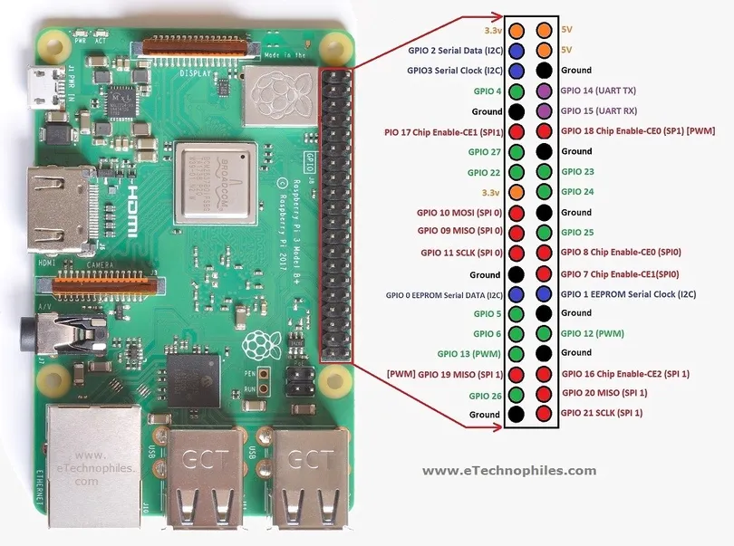
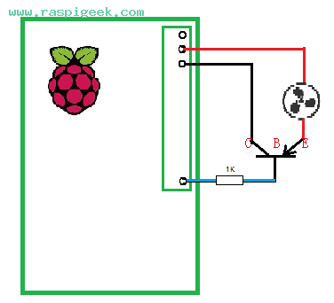
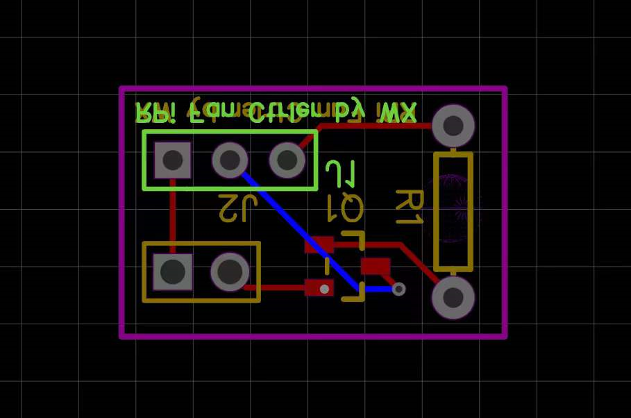
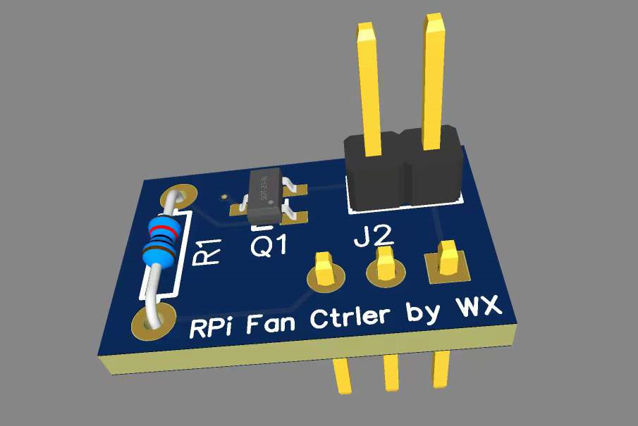
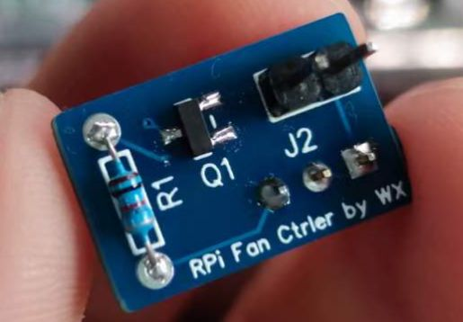
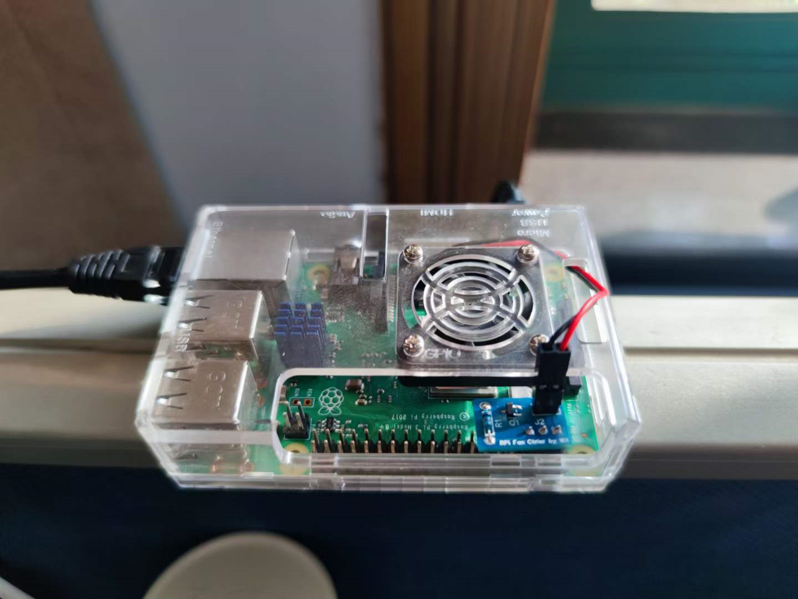

# rpi-fan-ctrler

Raspberry Pi Fan Controller——an electronic module for Raspberry Pi fan controlling. Tested on Raspberry Pi 3B+, while other Raspberry Pi versions should be exchangeable.

## RPi 3B+ Pinout



The GPIO 14 and above 5V and GND pins are chosen to be controller output.

## Circuit Diagram

Refer to [this article](http://www.raspigeek.com/index.php?c=read&id=126&page=1).



## PCB Design

The PCB project has been uploaded to [OSHWHub](https://oshwhub.com/wuxinzju/rpi_fan_controller).









## Controller Configurations

1. Put `fan_ctrl.sh` into your environment (`/root` for example). 
2. Configure `rc.local` to set auto start:

```bash
chmod +x /etc/rc.local
vim /etc/rc.local

# edit in rc.local, insert before the last line (i.e. exit 0)
/root/fan_ctrl.sh 2>>/root/fan_ctrl.log
```

